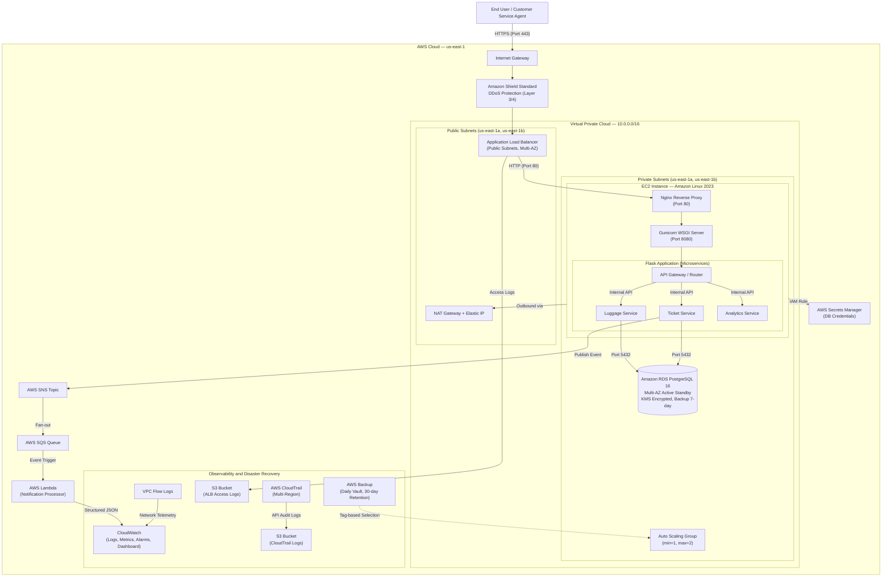
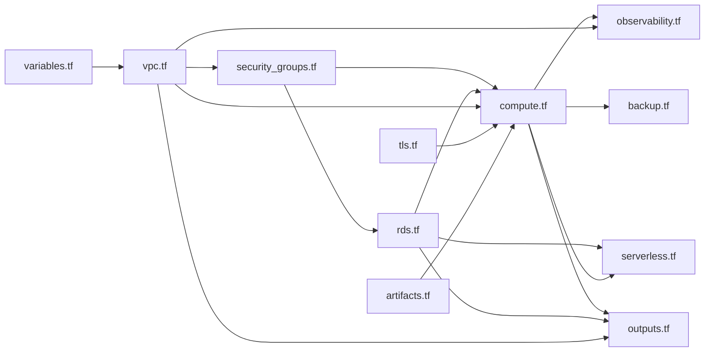

# Luggage Tracking System and Customer Service Portal

**Production-Grade AWS Infrastructure | ENPM818N - Spring 2026**

---

## Table of Contents

1. [Project Overview](#project-overview)
2. [System Requirements](#system-requirements)
3. [Setup and Deployment Guide](#setup-and-deployment-guide)
4. [Architecture Walkthrough](#architecture-walkthrough)
5. [Terraform Module Wiring](#terraform-module-wiring)
6. [Security Posture](#security-posture)
7. [High Availability and Disaster Recovery](#high-availability-and-disaster-recovery)
8. [Logging, Monitoring, and Observability](#logging-monitoring-and-observability)
9. [Cost Awareness](#cost-awareness)
10. [Screenshot Evidence](#screenshot-evidence)
11. [Team Contribution Summary](#team-contribution-summary)

---

## Project Overview

This project implements a production-style, highly available, secure, and observable luggage-tracking platform deployed on Amazon Web Services. The system stores and tracks luggage lifecycle events (check-in, loaded, in transit, arrived, delivered) and exposes a Customer Service Portal where agents can:

- **Search** for luggage by bag tag, customer name, or booking reference
- **View** the current status and chronological timeline of luggage events
- **Open, update, and resolve** support tickets for delayed or missing luggage
- **Monitor** system-wide analytics through a real-time dashboard

The application is built using a microservice architecture with Flask Blueprints (Luggage Service, Ticket Service, Analytics Service), backed by Amazon RDS PostgreSQL, and deployed through a fully automated Infrastructure-as-Code pipeline using Terraform.

---

## System Requirements

### Prerequisites

- **Terraform** (v1.5+) installed locally
- **AWS CLI** configured with valid credentials (`aws configure`)
- IAM permissions for: VPC, EC2, RDS, S3, Lambda, SNS, SQS, IAM, CloudWatch, CloudTrail, KMS, Secrets Manager, ACM, AWS Backup
- A modern web browser (for accessing the portal)

### Technology Stack

| Layer | Technology |
|-------|------------|
| Application | Python 3, Flask, Jinja2, Gunicorn |
| Database | Amazon RDS PostgreSQL 16 (Multi-AZ) |
| Web Server | Nginx (reverse proxy) |
| Infrastructure | Terraform (HashiCorp) |
| Serverless | AWS Lambda (Python 3.12), SNS, SQS |
| Monitoring | CloudWatch, CloudTrail, VPC Flow Logs |

---

## Setup and Deployment Guide

### Step 1: Clone the Repository

```bash
git clone <repository-url>
cd luggage-tracker
```

### Step 2: Initialize Terraform

```bash
cd terraform
terraform init
```

This downloads the required providers: AWS (~5.0), Random (~3.5), and TLS (~4.0).

### Step 3: Preview the Infrastructure Plan

```bash
terraform plan
```

Review the output to confirm the full set of resources that will be created.

### Step 4: Deploy the Infrastructure

```bash
terraform apply
```

Type `yes` when prompted. Deployment takes approximately 10-15 minutes (the Multi-AZ RDS instance is the longest resource to provision).

Upon completion, Terraform outputs three key values:

| Output | Description |
|--------|-------------|
| `alb_dns_name` | The public URL for the application |
| `rds_endpoint` | The private database endpoint |
| `db_secret_arn` | The ARN of the stored database credentials |

### Step 5: Access the Application

Navigate to `https://<alb_dns_name>` in your browser. Accept the self-signed certificate warning (the TLS certificate is auto-generated for demonstration purposes).

**Note:** There are zero manual steps required for database setup. The EC2 instances automatically pull credentials from AWS Secrets Manager and seed the PostgreSQL database with 50 sample luggage records during their first boot sequence.

### Step 6: Teardown

```bash
terraform destroy
```

All resources are configured for clean teardown (S3 buckets use `force_destroy`, RDS skips final snapshot, Backup Vault permits forced deletion).

---

## Architecture Walkthrough

The system follows a three-tier architecture pattern deployed across two AWS Availability Zones for high availability.

### Architecture Diagram



### Data Flow Summary

1. **Inbound Traffic**: Client requests arrive via HTTPS on port 443 at the ALB. HTTP (port 80) requests are automatically redirected to HTTPS.
2. **Load Balancing**: The ALB terminates TLS and forwards traffic to healthy EC2 instances in private subnets.
3. **Application Processing**: Nginx reverse-proxies to Gunicorn, which runs the Flask application. Requests are routed to the appropriate microservice (Luggage, Ticket, or Analytics).
4. **Database Access**: Services query Amazon RDS PostgreSQL over port 5432. Credentials are retrieved from AWS Secrets Manager via the EC2 IAM Instance Profile.
5. **Event Pipeline**: When a support ticket is created, the Ticket Service publishes an event to SNS, which fans out to an SQS queue. A Lambda function consumes the queue, performs urgency classification, and emits structured analytics logs to CloudWatch.
6. **Outbound Traffic**: EC2 instances in private subnets access the internet (for package updates, S3 artifact pulls) through the NAT Gateway in the public subnet.

---

## Terraform Module Wiring

The infrastructure is organized into modular Terraform files, each responsible for a distinct layer. Below is the dependency graph showing how modules reference each other.

### File Structure

```
terraform/
  providers.tf          — Provider configuration and default tags
  variables.tf          — Input variables (region, CIDRs, AZs)
  vpc.tf                — VPC, subnets, IGW, NAT, route tables
  security_groups.tf    — ALB, App, and DB security groups
  rds.tf                — RDS instance, KMS key, Secrets Manager, DB subnet group
  compute.tf            — IAM roles, launch template, ASG, ALB, listeners
  serverless.tf         — SNS, SQS, Lambda, event source mapping
  artifacts.tf          — S3 artifacts bucket, app.zip upload
  observability.tf      — CloudWatch, CloudTrail, ALB logs, VPC Flow Logs
  backup.tf             — AWS Backup vault, plan, and selection
  tls.tf                — Self-signed TLS certificate and ACM import
  outputs.tf            — Exported values (ALB DNS, RDS endpoint, etc.)
  user_data.sh          — EC2 bootstrap script (packages, app deployment, CW agent)
```

### Module Dependency Map



### Key Cross-File References

| Producing File | Resource | Consumed By | Usage |
|----------------|----------|-------------|-------|
| `vpc.tf` | `aws_vpc.main`, `aws_subnet.public/private` | `security_groups.tf`, `compute.tf`, `rds.tf`, `observability.tf` | VPC ID, subnet IDs for placement |
| `security_groups.tf` | `aws_security_group.alb_sg`, `app_sg`, `db_sg` | `compute.tf`, `rds.tf` | Security group assignments |
| `rds.tf` | `aws_secretsmanager_secret`, `aws_db_instance` | `compute.tf` | IAM policy references, `depends_on` for boot order |
| `rds.tf` | `aws_kms_key.rds` | `rds.tf` (internal) | Encryption key for RDS storage |
| `tls.tf` | `aws_acm_certificate.alb_cert` | `compute.tf` | HTTPS listener certificate ARN |
| `artifacts.tf` | `aws_s3_bucket.app_artifacts` | `compute.tf` | S3 bucket name injected into `user_data.sh` |
| `serverless.tf` | `aws_sns_topic.support_tickets` | `compute.tf` | IAM policy granting EC2 SNS publish access |
| `compute.tf` | `aws_autoscaling_group.app_asg` | `observability.tf`, `backup.tf` | CloudWatch alarm dimensions, backup tag selection |

---

## Security Posture

### Encryption at Rest

- **RDS Storage**: Encrypted using a dedicated AWS KMS key with automatic key rotation enabled (`aws_kms_key.rds` in `rds.tf`)
- **EC2 EBS Volumes**: Launch template enforces encrypted gp3 volumes (`encrypted = true` in `compute.tf`)
- **S3 Buckets**: Server-side encryption enabled by default (AWS S3 behavior for all new buckets)

### Encryption in Transit

- **HTTPS Enforcement**: The ALB listens on port 443 with a TLS certificate. All HTTP (port 80) traffic is automatically redirected to HTTPS via a 301 redirect rule.
- **Self-Signed Certificate**: A TLS certificate is dynamically generated using the Terraform `tls` provider and imported into AWS Certificate Manager (`tls.tf`).

### Secrets Management

Database credentials are never hardcoded. The flow is:
1. Terraform generates a random 16-character password using the `random_password` provider
2. The password is injected into AWS Secrets Manager (`aws_secretsmanager_secret` in `rds.tf`)
3. EC2 instances retrieve credentials at runtime using their IAM Instance Profile

### DDoS Protection — Amazon Shield Standard

The application is fronted by an Application Load Balancer (ALB), which automatically receives Amazon Shield Standard protection at no additional cost. Shield Standard provides always-on detection and inline mitigation against the most common Layer 3 and Layer 4 network-level DDoS attacks, including SYN floods, UDP reflection attacks, and other volumetric threats.

### Least-Privilege Security Groups and IAM

- **Security Group Chaining**: The ALB SG allows public HTTP/HTTPS inbound. The App SG only accepts traffic from the ALB SG. The DB SG only accepts PostgreSQL (5432) from the App SG and VPC CIDR.
- **IAM Policies**: The EC2 role is scoped to specific resource ARNs for Secrets Manager, SNS, S3, CloudWatch Logs, and SSM. The Lambda role is limited to SQS receive/delete and CloudWatch Logs.

---

## High Availability and Disaster Recovery

### Multi-AZ Redundancy

- **VPC**: Spans two Availability Zones (`us-east-1a` and `us-east-1b`) with 2 public and 2 private subnets
- **Auto Scaling Group**: EC2 instances are distributed across both AZs (min=1, max=2)
- **RDS**: Deployed with Multi-AZ enabled, providing a synchronous standby replica with automatic failover

### Self-Healing

The ASG uses ELB-based health checks. If the ALB health check (`/health` endpoint) fails, the ASG automatically terminates the unhealthy instance and launches a replacement.

### Backup Strategy

| Component | Backup Method | Retention |
|-----------|---------------|-----------|
| EC2 Instances | AWS Backup (daily, tag-based: `Backup=Daily`) | 30 days |
| RDS Database | Automated snapshots (daily, 03:00-04:00 UTC window) | 7 days |
| S3 Artifacts | Bucket versioning enabled | Indefinite |

---

## Logging, Monitoring, and Observability

| Capability | Implementation | Evidence Location |
|------------|----------------|-------------------|
| Application Logging | CloudWatch Agent streams Nginx access/error logs to CloudWatch Log Groups | CloudWatch Console |
| CloudWatch Metrics and Alarms | CPU utilization alarm (threshold: 80%) on the ASG | CloudWatch Alarms |
| CloudWatch Dashboard | Custom dashboard (`LuggageSystemMetrics`) with ASG CPU widget | CloudWatch Dashboards |
| ALB Access Logging | Access logs shipped to a dedicated S3 bucket | S3 Console |
| CloudTrail | Multi-region trail with log file validation, stored in S3 | CloudTrail Console and S3 |
| VPC Flow Logs | All traffic logged to a CloudWatch Log Group (7-day retention) | CloudWatch Log Groups |
| Lambda Logs | Structured JSON logs emitted by the ticket processor Lambda | CloudWatch Log Groups |

---

## Cost Awareness

The architecture is designed to minimize costs while meeting production-grade requirements:

| Decision | Cost Impact |
|----------|-------------|
| `t3.micro` for EC2 and RDS | Smallest general-purpose instances; eligible for free tier |
| ASG min=1, max=2 | Avoids over-provisioning; scales only when needed |
| Single NAT Gateway | Reduces cost vs. one-per-AZ (acceptable trade-off for non-critical workloads) |
| `skip_final_snapshot = true` on RDS | Avoids orphaned snapshot storage charges during teardown |
| `force_destroy = true` on S3 buckets and Backup Vault | Ensures clean teardown with no residual charges |
| KMS key `deletion_window_in_days = 7` | Minimum window to avoid lingering key charges |
| CloudWatch log retention = 7 days | Limits log storage costs |
| Lambda with SQS (vs. always-on compute) | Pay-per-invocation; zero cost when idle |
| Self-signed TLS certificate | Avoids ACM public certificate validation complexity and Route 53 costs |

**Estimated cost for a 1-hour deployment: approximately $0.15 - $0.20**

---

## Screenshot Evidence

All required evidence screenshots are compiled in the `Updated_screenshots.docx` file included in this submission. The evidence covers the following categories:

### Infrastructure Evidence
- Terraform plan and apply outputs
- VPC subnets across multiple Availability Zones
- Public and private subnet route tables (IGW and NAT Gateway routing)
- Security group configurations (ALB, App, DB)
- RDS database details (endpoint, Multi-AZ, subnet group)
- ALB listeners (HTTPS and HTTP redirect)
- Target group with healthy targets
- Auto Scaling Group configuration and running instances

### Encryption Evidence
- RDS storage encryption enabled with KMS key
- EC2 EBS volume encryption enabled
- HTTPS listener with TLS certificate

### DDoS Protection Evidence
- Amazon Shield Standard overview page

### Secrets Management Evidence
- AWS Secrets Manager secret (value not revealed)

### Application Functionality Evidence
- Landing page, dashboard, and navigation
- Luggage search by bag tag, customer name, and booking reference
- Luggage status timeline with chronological event history
- New luggage registration
- Ticket center, ticket creation, and ticket resolution

### Logging and Monitoring Evidence
- CloudWatch dashboard with CPU utilization metrics
- CloudWatch alarm configuration
- Application log groups and log stream entries
- VPC Flow Log entries
- CloudTrail event history and S3 log files
- ALB access log files in S3
- SNS topic with SQS subscription
- SQS queue monitoring metrics
- Lambda CloudWatch logs showing processed ticket events

### Auto Scaling Demonstration Evidence
- Auto Scaling Group details (min/max/desired capacity)
- Instance management showing running instances

### Additional Evidence
- AWS Backup plan and vault configuration
- Cost Explorer (estimated deployment costs)

---

## Team Contribution Summary

| Role | Team Member | Responsibilities |
|------|-------------|-----------------|
| **Infrastructure and Networking Lead** | Jacob Burkhardt | Designed and provisioned the VPC spanning two Availability Zones, configured public and private subnets with appropriate route tables, deployed the Application Load Balancer with HTTPS/HTTP listeners, created the Launch Template and Auto Scaling Group, set up the NAT Gateway and Internet Gateway, and validated end-to-end network connectivity between all components. |
| **Application and Portal Lead** | Satyajeet Watharkar | Built the Flask-based Customer Service Portal with microservice architecture (Luggage Service, Ticket Service, Analytics Service), implemented multi-identifier search (bag tag, customer, booking reference), luggage status timeline views, support ticket lifecycle management, health check endpoint for the ALB, and integrated Boto3 for SNS publishing and Secrets Manager credential retrieval. |
| **Database and Security Lead** | Semileniola Bernice Salako | Designed the relational schema for luggage records, events, support tickets, and ticket activity. Deployed and configured Amazon RDS PostgreSQL with Multi-AZ, enabled KMS encryption at rest for RDS and EC2 volumes, enforced HTTPS with self-signed TLS certificates via ACM, configured Secrets Manager for credential lifecycle, documented Shield Standard DDoS protection, and enforced least-privilege security group and IAM designs. |
| **Logging, Monitoring, Testing, and Documentation Lead** | Ruthvik Arun Shetty | Configured CloudWatch Logs, metrics, dashboards, and CPU alarms. Enabled CloudTrail with multi-region logging and S3 storage, ALB access logging to S3, and VPC Flow Logs to CloudWatch. Built the SNS to SQS to Lambda serverless pipeline for ticket event processing. Created the test plan, collected deployment evidence and screenshots, prepared the architecture diagram, and wrote the README, deployment guide, and presentation documentation. |

---

*ENPM818N — Cloud Computing and DevSecOps — Spring 2026*
