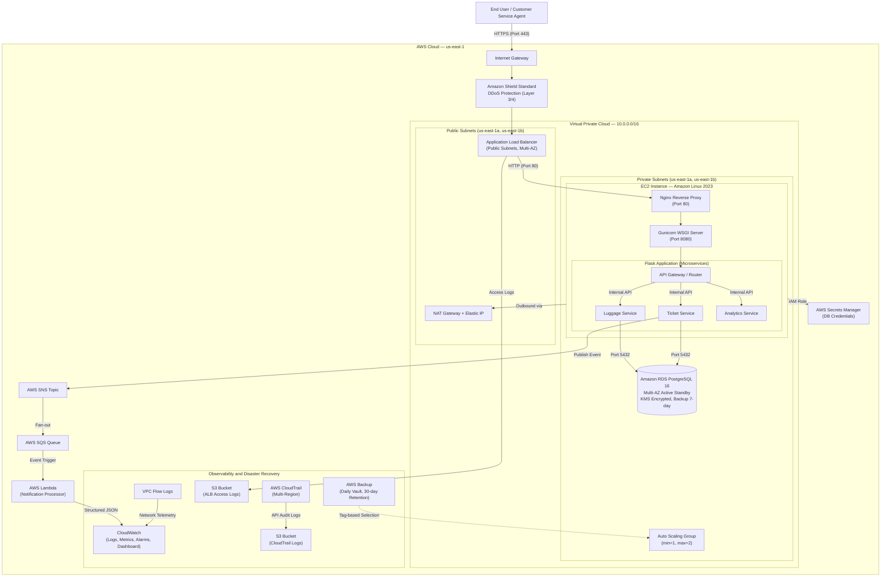
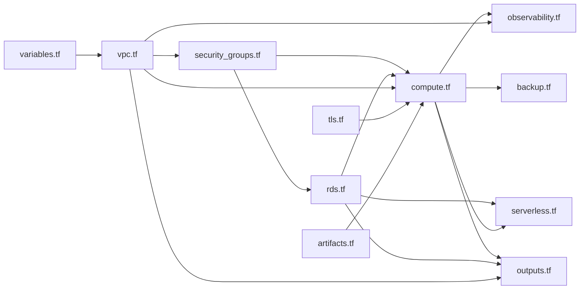

# Luggage Tracking System and Customer Service Portal

**Production-Grade AWS Infrastructure | ENPM818N - Spring 2026**

---

## Table of Contents

1. [Project Overview](#project-overview)
2. [System Requirements](#system-requirements)
3. [Setup and Deployment Guide](#setup-and-deployment-guide)
4. [Architecture Walkthrough](#architecture-walkthrough)
5. [Terraform Module Wiring](#terraform-module-wiring)
6. [Security Posture](#security-posture)
7. [Microservices Architecture](#microservices-architecture)
8. [Fault Tolerance](#fault-tolerance)
9. [Failover Mechanisms](#failover-mechanisms)
10. [Health Checks and Self-Healing](#health-checks-and-self-healing)
11. [Data Backups and Replication](#data-backups-and-replication)
12. [Logging, Monitoring, and Observability](#logging-monitoring-and-observability)
13. [Cost Awareness](#cost-awareness)
14. [Screenshot Evidence](#screenshot-evidence)
15. [Portal Features to Try Out](#portal-features-to-try-out)
16. [Challenges Faced](#challenges-faced)
17. [Team Contribution Summary](#team-contribution-summary)

---

## Project Overview

This project implements a production-style, highly available, secure, and observable luggage-tracking platform deployed on Amazon Web Services. The system stores and tracks luggage lifecycle events (check-in, loaded, in transit, arrived, delivered) and exposes a Customer Service Portal where agents can:

- **Search** for luggage by bag tag, customer name, or booking reference
- **View** the current status and chronological timeline of luggage events
- **Open, update, and resolve** support tickets for delayed or missing luggage
- **Monitor** system-wide analytics through a real-time dashboard

The application is built using a microservice architecture with Flask Blueprints (Luggage Service, Ticket Service, Analytics Service), backed by Amazon RDS PostgreSQL, and deployed through a fully automated Infrastructure-as-Code pipeline using Terraform.

---

## System Requirements

### Prerequisites

- **Terraform** (v1.5+) installed locally
- **AWS CLI** configured with valid credentials (`aws configure`)
- IAM permissions for: VPC, EC2, RDS, S3, Lambda, SNS, SQS, IAM, CloudWatch, CloudTrail, KMS, Secrets Manager, ACM, AWS Backup
- A modern web browser (for accessing the portal)

### Technology Stack

| Layer | Technology |
|-------|------------|
| Application | Python 3, Flask, Jinja2, Gunicorn |
| Database | Amazon RDS PostgreSQL 16 (Multi-AZ) |
| Web Server | Nginx (reverse proxy) |
| Infrastructure | Terraform (HashiCorp) |
| Serverless | AWS Lambda (Python 3.12), SNS, SQS |
| Monitoring | CloudWatch, CloudTrail, VPC Flow Logs |

---

## Setup and Deployment Guide

### Step 1: Clone the Repository

```bash
git clone <repository-url>
cd luggage-tracker
```

### Step 2: Initialize Terraform

```bash
cd terraform
terraform init
```

This downloads the required providers: AWS (~5.0), Random (~3.5), and TLS (~4.0).

### Step 3: Preview the Infrastructure Plan

```bash
terraform plan
```

Review the output to confirm the full set of resources that will be created.

### Step 4: Deploy the Infrastructure

```bash
terraform apply
```

Type `yes` when prompted. Deployment takes approximately 10-15 minutes (the Multi-AZ RDS instance is the longest resource to provision).

Upon completion, Terraform outputs three key values:

| Output | Description |
|--------|-------------|
| `alb_dns_name` | The public URL for the application |
| `rds_endpoint` | The private database endpoint |
| `db_secret_arn` | The ARN of the stored database credentials |

### Step 5: Access the Application

Navigate to `https://<alb_dns_name>` in your browser. Accept the self-signed certificate warning (the TLS certificate is auto-generated for demonstration purposes).

**Note:** There are zero manual steps required for database setup. The EC2 instances automatically pull credentials from AWS Secrets Manager and seed the PostgreSQL database with 50 sample luggage records during their first boot sequence.

### Step 6: Teardown

```bash
terraform destroy
```

All resources are configured for clean teardown (S3 buckets use `force_destroy`, RDS skips final snapshot, Backup Vault permits forced deletion).

---

## Architecture Walkthrough

The system follows a three-tier architecture pattern deployed across two AWS Availability Zones for high availability.

### Architecture Diagram



### Data Flow Summary

1. **Inbound Traffic**: Client requests arrive via HTTPS on port 443 at the ALB. HTTP (port 80) requests are automatically redirected to HTTPS.
2. **Load Balancing**: The ALB terminates TLS and forwards traffic to healthy EC2 instances in private subnets.
3. **Application Processing**: Nginx reverse-proxies to Gunicorn, which runs the Flask application. Requests are routed to the appropriate microservice (Luggage, Ticket, or Analytics).
4. **Database Access**: Services query Amazon RDS PostgreSQL over port 5432. Credentials are retrieved from AWS Secrets Manager via the EC2 IAM Instance Profile.
5. **Event Pipeline**: When a support ticket is created, the Ticket Service publishes an event to SNS, which fans out to an SQS queue. A Lambda function consumes the queue, performs urgency classification, and emits structured analytics logs to CloudWatch.
6. **Outbound Traffic**: EC2 instances in private subnets access the internet (for package updates, S3 artifact pulls) through the NAT Gateway in the public subnet.

---

## Terraform Module Wiring

The infrastructure is organized into modular Terraform files, each responsible for a distinct layer. Below is the dependency graph showing how modules reference each other.

### File Structure

```
terraform/
  providers.tf          — Provider configuration and default tags
  variables.tf          — Input variables (region, CIDRs, AZs)
  vpc.tf                — VPC, subnets, IGW, NAT, route tables
  security_groups.tf    — ALB, App, and DB security groups
  rds.tf                — RDS instance, KMS key, Secrets Manager, DB subnet group
  compute.tf            — IAM roles, launch template, ASG, ALB, listeners
  serverless.tf         — SNS, SQS, Lambda, event source mapping
  artifacts.tf          — S3 artifacts bucket, app.zip upload
  observability.tf      — CloudWatch, CloudTrail, ALB logs, VPC Flow Logs
  backup.tf             — AWS Backup vault, plan, and selection
  tls.tf                — Self-signed TLS certificate and ACM import
  outputs.tf            — Exported values (ALB DNS, RDS endpoint, etc.)
  user_data.sh          — EC2 bootstrap script (packages, app deployment, CW agent)
```

### Module Dependency Map



### Key Cross-File References

| Producing File | Resource | Consumed By | Usage |
|----------------|----------|-------------|-------|
| `vpc.tf` | `aws_vpc.main`, `aws_subnet.public/private` | `security_groups.tf`, `compute.tf`, `rds.tf`, `observability.tf` | VPC ID, subnet IDs for placement |
| `security_groups.tf` | `aws_security_group.alb_sg`, `app_sg`, `db_sg` | `compute.tf`, `rds.tf` | Security group assignments |
| `rds.tf` | `aws_secretsmanager_secret`, `aws_db_instance` | `compute.tf` | IAM policy references, `depends_on` for boot order |
| `rds.tf` | `aws_kms_key.rds` | `rds.tf` (internal) | Encryption key for RDS storage |
| `tls.tf` | `aws_acm_certificate.alb_cert` | `compute.tf` | HTTPS listener certificate ARN |
| `artifacts.tf` | `aws_s3_bucket.app_artifacts` | `compute.tf` | S3 bucket name injected into `user_data.sh` |
| `serverless.tf` | `aws_sns_topic.support_tickets` | `compute.tf` | IAM policy granting EC2 SNS publish access |
| `compute.tf` | `aws_autoscaling_group.app_asg` | `observability.tf`, `backup.tf` | CloudWatch alarm dimensions, backup tag selection |

---

## Security Posture

### Encryption at Rest

- **RDS Storage**: Encrypted using a dedicated AWS KMS key with automatic key rotation enabled (`aws_kms_key.rds` in `rds.tf`)
- **EC2 EBS Volumes**: Launch template enforces encrypted gp3 volumes (`encrypted = true` in `compute.tf`)
- **S3 Buckets**: Server-side encryption enabled by default (AWS S3 behavior for all new buckets)

### Encryption in Transit

- **HTTPS Enforcement**: The ALB listens on port 443 with a TLS certificate. All HTTP (port 80) traffic is automatically redirected to HTTPS via a 301 redirect rule.
- **Self-Signed Certificate**: A TLS certificate is dynamically generated using the Terraform `tls` provider and imported into AWS Certificate Manager (`tls.tf`).

### Secrets Management

Database credentials are never hardcoded. The flow is:
1. Terraform generates a random 16-character password using the `random_password` provider
2. The password is injected into AWS Secrets Manager (`aws_secretsmanager_secret` in `rds.tf`)
3. EC2 instances retrieve credentials at runtime using their IAM Instance Profile

### DDoS Protection — Amazon Shield Standard

The application is fronted by an Application Load Balancer (ALB), which automatically receives Amazon Shield Standard protection at no additional cost. Shield Standard provides always-on detection and inline mitigation against the most common Layer 3 and Layer 4 network-level DDoS attacks, including SYN floods, UDP reflection attacks, and other volumetric threats.

### Least-Privilege Security Groups and IAM

- **Security Group Chaining**: The ALB SG allows public HTTP/HTTPS inbound. The App SG only accepts traffic from the ALB SG. The DB SG only accepts PostgreSQL (5432) from the App SG and VPC CIDR.
- **IAM Policies**: The EC2 role is scoped to specific resource ARNs for Secrets Manager, SNS, S3, CloudWatch Logs, and SSM. The Lambda role is limited to SQS receive/delete and CloudWatch Logs.

---

## Microservices Architecture

The application follows a modular microservice pattern implemented using Flask Blueprints. Each service owns a specific business domain and communicates with other services through internal JSON API endpoints, eliminating tightly coupled database JOINs across domain boundaries.

### Service Decomposition

```
src/
  app.py                          # API Gateway — registers all Blueprints, health check
  services/
    luggage/                      # Luggage Service (bag records, events, search)
      __init__.py                 #   Blueprint registration
      routes.py                  #   User-facing routes (search, bag detail, register)
      api.py                     #   Internal JSON API (/api/luggage/<bag_tag>, /api/luggage/stats)
    tickets/                      # Ticket Service (support tickets, SLA tracking)
      __init__.py                 #   Blueprint registration
      routes.py                  #   User-facing routes (ticket list, create, update)
      api.py                     #   Internal JSON API (/api/tickets/by-bag/<tag>, /api/tickets/stats)
    analytics/                    # Analytics Service (dashboard, metrics aggregation)
      __init__.py                 #   Blueprint registration
      routes.py                  #   Dashboard route — consumes Luggage + Ticket APIs
  shared/
    db.py                         # Shared database connection layer
    constants.py                  # Shared constants (statuses, priorities, SLA definitions)
```

### Inter-Service Communication

Services communicate through internal JSON API calls rather than direct cross-domain database queries:

| Consumer | Provider | API Endpoint | Purpose |
|----------|----------|--------------|---------|
| Ticket Service | Luggage Service | `/api/luggage/<bag_tag>` | Fetch bag details when creating/viewing tickets |
| Ticket Service | Luggage Service | `/api/luggage/all-tags` | Populate bag selector dropdown on ticket creation form |
| Ticket Service | Luggage Service | `/api/luggage/batch?tags=...` | Batch-resolve customer names for ticket list views |
| Analytics Service | Luggage Service | `/api/luggage/stats` | Aggregate luggage metrics for dashboard |
| Analytics Service | Ticket Service | `/api/tickets/stats` | Aggregate ticket metrics for dashboard |
| Analytics Service | Ticket Service | `/api/tickets/recent` | Display recent ticket activity on dashboard |
| Luggage Service | Ticket Service | `/api/tickets/by-bag/<tag>` | Show related tickets on bag detail page |
| Gateway | Ticket Service | Internal function | Sidebar badge showing open ticket count |

Each service also exposes its own health check endpoint (`/api/luggage/health`, `/api/tickets/health`) for independent service monitoring.

### Serverless Event Pipeline

When a support ticket is created, the Ticket Service publishes a structured event to AWS SNS, which fans out to an SQS queue. A Lambda function consumes the queue, classifies urgency based on keywords (lost, stolen, urgent, critical), and emits structured JSON analytics logs to CloudWatch for operational visibility. This decoupled architecture ensures the ticket creation flow is never blocked by downstream processing.

```
Ticket Service --> SNS Topic --> SQS Queue --> Lambda Function --> CloudWatch Logs
```

---

## Fault Tolerance

The system is designed to continue operating correctly even when individual components experience failures. Fault tolerance is achieved through redundancy, isolation, and automated recovery at every layer of the architecture.

### Multi-AZ Redundancy

- **VPC**: Spans two Availability Zones (`us-east-1a` and `us-east-1b`) with 2 public and 2 private subnets, ensuring no single data center is a point of failure
- **Auto Scaling Group**: EC2 instances are distributed across both AZs. If one AZ experiences an outage, the ASG maintains capacity in the surviving AZ
- **RDS Multi-AZ**: The PostgreSQL database is deployed with Multi-AZ enabled, maintaining a synchronous standby replica in a separate AZ
- **ALB**: The Application Load Balancer is deployed across both public subnets, automatically routing traffic only to healthy targets

### Network Isolation

Traffic flows through strictly segmented layers, each with its own security group:

1. **Public Layer** (ALB, NAT Gateway): Accepts inbound HTTPS from the internet
2. **Application Layer** (EC2 in private subnets): Accepts traffic only from the ALB security group
3. **Data Layer** (RDS in private subnets): Accepts connections only from the Application security group on port 5432

If any single layer is compromised, the blast radius is contained by security group boundaries.

### Serverless Decoupling

The SNS-SQS-Lambda pipeline decouples ticket event processing from the main application. If the Lambda function fails or the SQS queue backs up, the core application continues to function normally. SQS provides built-in message retention (up to 4 days by default), ensuring no events are lost during transient failures.

---

## Failover Mechanisms

### Database Failover

Amazon RDS Multi-AZ provides automatic failover for the PostgreSQL database:

1. **Normal Operation**: All reads and writes go to the primary instance in one AZ
2. **Failure Detection**: AWS continuously monitors the primary instance for hardware failures, network issues, or AZ-level outages
3. **Automatic Failover**: If the primary fails, RDS automatically promotes the standby replica in the other AZ. The DNS endpoint remains the same, so the application reconnects transparently without configuration changes
4. **Failover Time**: Typically completes within 60-120 seconds

### Compute Failover

The Auto Scaling Group handles compute-level failover:

1. **Instance Failure**: If an EC2 instance crashes or becomes unresponsive, the ALB stops routing traffic to it based on health check failures
2. **AZ Failure**: If an entire AZ goes down, the ASG launches replacement instances in the surviving AZ
3. **Application Failure**: If the Flask application crashes (Gunicorn process dies), the systemd service automatically restarts it. If the restart fails, the ALB health check detects the failure and the ASG replaces the instance

### Load Balancer Failover

The ALB continuously monitors registered targets and only routes traffic to instances that pass health checks. Unhealthy targets are automatically removed from the rotation and re-added once they recover.

---

## Health Checks and Self-Healing

### Health Check Chain

The system implements a multi-layered health check strategy:

| Layer | Health Check | Mechanism | Interval |
|-------|-------------|-----------|----------|
| **ALB to EC2** | `GET /health` returns HTTP 200 | ALB target group health check | Every 30 seconds |
| **ASG to ALB** | ELB-based health check | ASG queries ALB target health status | Continuous |
| **Luggage Service** | `GET /api/luggage/health` | Service-level health endpoint | On-demand |
| **Ticket Service** | `GET /api/tickets/health` | Service-level health endpoint | On-demand |
| **CloudWatch Alarm** | CPU utilization threshold (80%) | CloudWatch metric monitoring | Every 2 minutes |

### Self-Healing Workflow

When a failure is detected, the system automatically recovers without manual intervention:

```
1. Flask app crashes or EC2 instance fails
       |
2. ALB health check (/health) returns non-200 or times out
       |
3. ALB marks target as "unhealthy" (after 2 consecutive failures)
       |
4. ALB stops routing traffic to unhealthy target
       |
5. ASG detects unhealthy instance (health_check_type = "ELB")
       |
6. ASG terminates the unhealthy instance
       |
7. ASG launches a new instance from the Launch Template
       |
8. New instance runs user_data.sh (installs packages, pulls code from S3, starts services)
       |
9. ALB health check passes on new instance
       |
10. ALB adds new instance to rotation — traffic resumes
```

The entire self-healing cycle typically completes within 3-5 minutes.

### Process-Level Recovery

On each EC2 instance, Gunicorn runs as a systemd service with `Restart=always`. If the application process crashes, systemd restarts it immediately without triggering a full instance replacement.

---

## Data Backups and Replication

### RDS Automated Backups

| Setting | Value | Purpose |
|---------|-------|---------|
| Backup retention | 7 days | Point-in-time recovery for the past week |
| Backup window | 03:00 - 04:00 UTC | Runs during lowest traffic period |
| Multi-AZ replication | Synchronous | Real-time standby replica in a different AZ |
| Storage encryption | KMS with auto-rotation | All backups are encrypted at rest |
| Final snapshot on delete | Skipped (`skip_final_snapshot = true`) | Clean teardown for development environments |

RDS automated backups enable point-in-time recovery (PITR) to any second within the 7-day retention window. If data corruption occurs, the database can be restored to the exact moment before the corruption happened.

### EC2 Compute Backups (AWS Backup)

| Setting | Value | Purpose |
|---------|-------|---------|
| Backup frequency | Daily at 05:00 UTC | Consistent daily snapshots |
| Target selection | Tag-based (`Backup=Daily`) | Automatically includes all ASG instances |
| Retention | 30 days | Full month of recovery points |
| Vault | `luggage-system-backup-vault` | Centralized, isolated backup storage |

AWS Backup creates daily EBS snapshots of all EC2 instances tagged with `Backup=Daily`. The ASG propagates this tag to every instance it launches, ensuring new instances are automatically enrolled in the backup plan.

### S3 Artifact Versioning

The application artifacts bucket (`luggage-app-artifacts`) has versioning enabled. Every update to `app.zip` creates a new version, allowing rollback to any previous deployment package. Accidental deletions can be recovered by restoring the previous version.

### Replication Summary

```
                    ┌─────────────────────────────────────┐
                    │        Data Protection Layers        │
                    ├─────────────────────────────────────┤
  RDS Database ───► │ Synchronous Multi-AZ Replication     │ Real-time
                    │ Automated Daily Backups (7-day PITR) │ Daily
                    ├─────────────────────────────────────┤
  EC2 Instances ──► │ AWS Backup EBS Snapshots (30-day)    │ Daily
                    │ ASG auto-replacement from S3 code    │ On failure
                    ├─────────────────────────────────────┤
  S3 Artifacts ───► │ Bucket Versioning (all versions)     │ On write
                    │ force_destroy for clean teardown      │ On destroy
                    └─────────────────────────────────────┘
```

---

## Logging, Monitoring, and Observability

| Capability | Implementation | Evidence Location |
|------------|----------------|-------------------|
| Application Logging | CloudWatch Agent streams Nginx access/error logs to CloudWatch Log Groups | CloudWatch Console |
| CloudWatch Metrics and Alarms | CPU utilization alarm (threshold: 80%) on the ASG | CloudWatch Alarms |
| CloudWatch Dashboard | Custom dashboard (`LuggageSystemMetrics`) with ASG CPU widget | CloudWatch Dashboards |
| ALB Access Logging | Access logs shipped to a dedicated S3 bucket | S3 Console |
| CloudTrail | Multi-region trail with log file validation, stored in S3 | CloudTrail Console and S3 |
| VPC Flow Logs | All traffic logged to a CloudWatch Log Group (7-day retention) | CloudWatch Log Groups |
| Lambda Logs | Structured JSON logs emitted by the ticket processor Lambda | CloudWatch Log Groups |

---

## Cost Awareness

The architecture is designed to minimize costs while meeting production-grade requirements:

| Decision | Cost Impact |
|----------|-------------|
| `t3.micro` for EC2 and RDS | Smallest general-purpose instances; eligible for free tier |
| ASG min=1, max=2 | Avoids over-provisioning; scales only when needed |
| Single NAT Gateway | Reduces cost vs. one-per-AZ (acceptable trade-off for non-critical workloads) |
| `skip_final_snapshot = true` on RDS | Avoids orphaned snapshot storage charges during teardown |
| `force_destroy = true` on S3 buckets and Backup Vault | Ensures clean teardown with no residual charges |
| KMS key `deletion_window_in_days = 7` | Minimum window to avoid lingering key charges |
| CloudWatch log retention = 7 days | Limits log storage costs |
| Lambda with SQS (vs. always-on compute) | Pay-per-invocation; zero cost when idle |
| Self-signed TLS certificate | Avoids ACM public certificate validation complexity and Route 53 costs |

**Estimated cost for a 1-hour deployment: approximately $0.15 - $0.20**

---

## Screenshot Evidence

All required evidence screenshots are compiled in the `Screenshots.docx` file included in this submission. The evidence covers the following categories:

### Infrastructure Evidence
- Terraform plan and apply outputs
- VPC subnets across multiple Availability Zones
- Public and private subnet route tables (IGW and NAT Gateway routing)
- Security group configurations (ALB, App, DB)
- RDS database details (endpoint, Multi-AZ, subnet group)
- ALB listeners (HTTPS and HTTP redirect)
- Target group with healthy targets
- Auto Scaling Group configuration and running instances

### Evidence of Encryption Settings
- RDS storage encryption enabled with KMS key
- EC2 EBS volume encryption enabled
- HTTPS listener with TLS certificate

### Evidence of DDoS Protection
- Amazon Shield Standard overview page showing automatic protection for the ALB

### Secrets Management Evidence
- AWS Secrets Manager secret (value not revealed)

### Application Functionality Evidence
- Landing page, dashboard, and navigation
- Luggage search by bag tag, customer name, and booking reference
- Luggage status timeline with chronological event history
- New luggage registration
- Ticket center, ticket creation, and ticket resolution

### Logging and Monitoring Screenshots
- CloudWatch dashboard with CPU utilization metrics
- CloudWatch alarm configuration
- Application log groups and log stream entries
- VPC Flow Log entries
- CloudTrail event history and S3 log files
- ALB access log files in S3
- SNS topic with SQS subscription
- SQS queue monitoring metrics
- Lambda CloudWatch logs showing processed ticket events

### Auto Scaling Demonstration Evidence
- Auto Scaling Group details (min/max/desired capacity)
- Instance management showing running instances
- ASG self-healing demonstration (instance termination and automatic replacement)

### Additional Evidence
- AWS Backup plan and vault configuration

---

## Portal Features to Try Out

Beyond the core search-and-track functionality, the portal includes several production-grade features worth exploring:

### 1. Bulk Actions on Tickets

From the Ticket Center, select multiple tickets using the checkboxes and apply bulk operations:

- **Bulk Close**: Close all selected tickets in a single action
- **Bulk Assign**: Reassign all selected tickets to a different team (e.g., move 5 tickets to "Routing and Transfer" at once)
- **Bulk Priority Change**: Upgrade or downgrade the priority of multiple tickets simultaneously

Each bulk action is individually logged in every affected ticket's activity trail with a "System" author tag.

### 2. Ticket Escalation Engine

Click the **Escalate** button on any ticket detail page to trigger the escalation workflow:

| Escalation Level | Effect |
|------------------|--------|
| Level 0 (Normal) | Default state |
| Level 1 (Escalated) | If priority is P3 or P4, auto-bumps to P2 |
| Level 2 (Management) | Auto-bumps to P1, reassigns to "Management Escalation" team |

Escalation is a one-way ratchet — each click increases the level and cannot be reversed.

### 3. SLA Tracking and Breach Detection

Every ticket has an SLA deadline calculated from its priority:

| Priority | SLA Window |
|----------|------------|
| P1 (Critical) | 1 hour |
| P2 (High) | 4 hours |
| P3 (Medium) | 24 hours |
| P4 (Low) | 72 hours |

The ticket detail page shows a live SLA countdown with color-coded indicators (green, yellow, red, breached). Changing a ticket's priority automatically recalculates the SLA deadline. The Ticket Center sidebar shows the total count of SLA-breached tickets.

### 4. State Machine Transitions

Ticket status changes follow a strict state machine that prevents invalid transitions:

```
New  -->  In Progress  -->  Resolved  -->  Closed
  \           |    \                       /
   \--> On Hold --/  \---- Closed -------/
                                  \--> New (Reopen)
```

For example, you cannot jump directly from "New" to "Resolved" — you must go through "In Progress" first. The UI only shows valid transition buttons.

### 5. Auto-Assignment

When creating a ticket, the system automatically assigns a team and agent based on the issue category:

| Category | Auto-Assigned Team |
|----------|--------------------|
| Damage | Baggage Handling |
| Lost, Delayed, Misrouted | Routing and Transfer |
| Security | Security and Compliance |
| Other | Customer Relations |

Agents are distributed using a hash-based algorithm to ensure even workload distribution.

### 6. Work Notes and Activity Trail

Every ticket maintains a full audit trail. From the ticket detail page:

- Add free-text **work notes** with author attribution
- View the complete **activity history**: status changes, priority changes, escalations, assignments, and notes — all timestamped
- Activity entries show both old and new values for every state change

### 7. Advanced Ticket Filtering

The Ticket Center supports multi-dimensional filtering:

- **By Status**: New, In Progress, On Hold, Resolved, Closed
- **By Priority**: P1 through P4
- **By Team**: Filter by assigned team

Tickets are automatically sorted by priority (P1 first) and then by creation date (newest first).

### 8. Contextual Ticket Creation

Tickets can be created in two ways:

- **Standalone**: From the Ticket Center, selecting any bag from a dropdown
- **Contextual**: From a bag's detail page, pre-populated with the bag tag — useful for creating tickets while reviewing a bag's status timeline

### 9. Analytics Dashboard

The Dashboard aggregates real-time metrics from both the Luggage and Ticket services:

- Total bags tracked, delivery rate, average events per bag
- Ticket status distribution, priority breakdown, team workload
- SLA compliance rate and breach count
- Escalation statistics
- 10 most recent tickets with live priority badges

### 10. Multi-Identifier Search

The search engine supports three types of queries in a single input field:

- **Exact match by Bag Tag**: e.g., `BAG-A1B2C3D4`
- **Exact match by Booking Reference**: e.g., `BK-20250101-ABCD`
- **Fuzzy match by Customer Name**: partial name matching (e.g., searching "Smith" returns all customers with "Smith" in their name)

---

## Challenges Faced

### 1. RDS Multi-AZ Provisioning Time

Deploying a Multi-AZ RDS instance consistently took 12-20 minutes during `terraform apply`, which significantly slowed the development iteration cycle. To mitigate this, we used `skip_final_snapshot = true` to speed up teardown and added random suffixes to Secrets Manager and KMS alias names to prevent naming collisions during rapid destroy/re-apply cycles (AWS Secrets Manager soft-deletes secrets with a 7-day recovery window).

### 2. Database Seeding Idempotency

EC2 instances in an Auto Scaling Group can be terminated and replaced at any time. The user data script needed to be idempotent — it must seed the database on the very first instance launch but skip seeding on subsequent replacements to avoid duplicate data. We solved this by adding a check in `user_data.sh` that queries the `luggage_records` table count before deciding whether to run the seed script.

### 3. Cross-Service Data Access in Microservices

Decomposing the monolith into microservices required eliminating cross-domain database JOINs. The Ticket Service needed customer names from the Luggage Service, and the Analytics Service needed data from both. We introduced internal JSON API endpoints (`/api/luggage/batch`, `/api/tickets/stats`) to replace direct database queries across domain boundaries. One performance-critical JOIN in the recent tickets view was intentionally retained with a documented exception.

### 4. ALB Access Log Propagation Delay

ALB access logs are delivered to S3 on a best-effort basis with a typical delay of 5-10 minutes. During screenshot collection, we initially observed empty S3 buckets. The solution was to generate sufficient traffic by browsing the application, then wait at least 10 minutes before capturing the S3 evidence screenshots.

### 5. Self-Signed Certificate Browser Warnings

Using a self-signed TLS certificate triggers browser security warnings on every first visit. While a production deployment would use ACM with a validated domain, the self-signed approach was chosen to demonstrate encryption in transit without requiring Route 53 domain registration or DNS validation, keeping costs at zero.

### 6. Security Group Dependency Ordering

Security groups reference each other (the App SG references the ALB SG, the DB SG references the App SG). Terraform handles the dependency graph automatically, but during `terraform destroy`, security group deletion sometimes fails if ENIs are still attached. Using the ALB's `depends_on` for the S3 bucket policy and the ASG's `depends_on` for the Secrets Manager version ensured correct creation and destruction ordering.

### 7. CloudWatch Agent Configuration

Configuring the CloudWatch Agent on Amazon Linux 2023 required creating a JSON configuration file and starting the agent via a specific control script. The agent configuration had to be embedded directly in `user_data.sh` as a heredoc, since there is no external configuration management system in this deployment.

---

## Team Contribution Summary

| Role | Team Member | Responsibilities |
|------|-------------|-----------------|
| **Infrastructure and Networking Lead** | Jacob Burkhardt | Designed and provisioned the VPC spanning two Availability Zones, configured public and private subnets with appropriate route tables, deployed the Application Load Balancer with HTTPS/HTTP listeners, created the Launch Template and Auto Scaling Group, set up the NAT Gateway and Internet Gateway, and validated end-to-end network connectivity between all components. |
| **Application and Portal Lead** | Satyajeet Watharkar | Built the Flask-based Customer Service Portal with microservice architecture (Luggage Service, Ticket Service, Analytics Service), implemented multi-identifier search (bag tag, customer, booking reference), luggage status timeline views, support ticket lifecycle management, health check endpoint for the ALB, and integrated Boto3 for SNS publishing and Secrets Manager credential retrieval. |
| **Database and Security Lead** | Semileniola Bernice Salako | Designed the relational schema for luggage records, events, support tickets, and ticket activity. Deployed and configured Amazon RDS PostgreSQL with Multi-AZ, enabled KMS encryption at rest for RDS and EC2 volumes, enforced HTTPS with self-signed TLS certificates via ACM, configured Secrets Manager for credential lifecycle, documented Shield Standard DDoS protection, and enforced least-privilege security group and IAM designs. |
| **Logging, Monitoring, Testing, and Documentation Lead** | Ruthvik Arun Shetty | Configured CloudWatch Logs, metrics, dashboards, and CPU alarms. Enabled CloudTrail with multi-region logging and S3 storage, ALB access logging to S3, and VPC Flow Logs to CloudWatch. Built the SNS to SQS to Lambda serverless pipeline for ticket event processing. Created the test plan, collected deployment evidence and screenshots, prepared the architecture diagram, and wrote the README, deployment guide, and presentation documentation. |

---

*ENPM818N — Cloud Computing and DevSecOps — Spring 2026*
