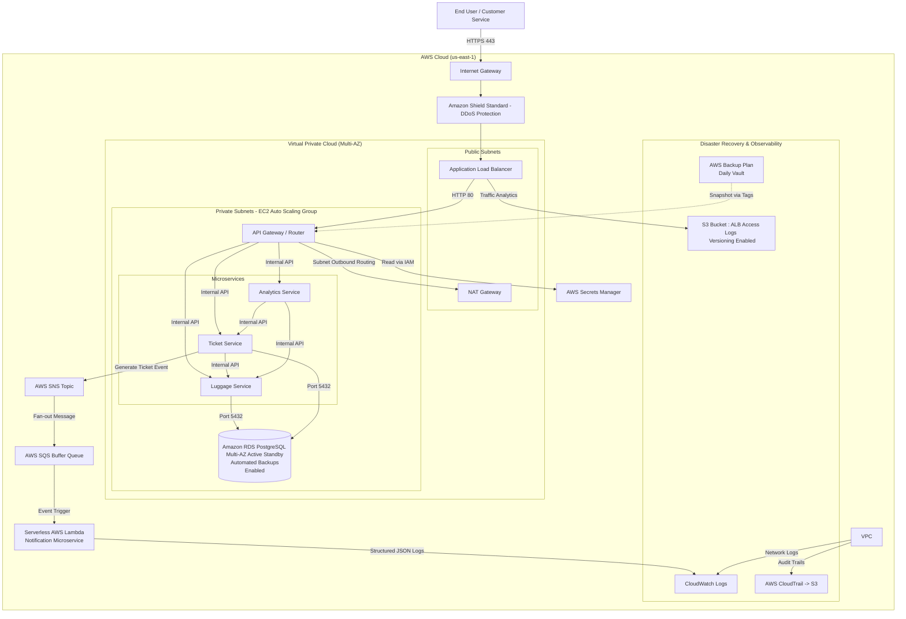

# Luggage Tracking System - Architecture

```mermaid
graph TD
    Client[End User / Customer Service] -->|HTTPS 443| IGW[Internet Gateway]
    
    subgraph "AWS Cloud (us-east-1)"
        IGW --> Shield[Amazon Shield Standard - DDoS Protection]
        Shield --> ALB[Application Load Balancer]
        
        subgraph "Virtual Private Cloud (Multi-AZ)"
            
            subgraph "Public Subnets"
                ALB
                NAT[NAT Gateway]
            end
            
            subgraph "Private Subnets - EC2 Auto Scaling Group"
                GW[API Gateway / Router]
                
                subgraph "Microservices"
                    LS[Luggage Service]
                    TS[Ticket Service]
                    AS[Analytics Service]
                end
                
                GW -->|Internal API| LS
                GW -->|Internal API| TS
                GW -->|Internal API| AS
                TS -->|Internal API| LS
                AS -->|Internal API| LS
                AS -->|Internal API| TS
                
                RDS[(Amazon RDS PostgreSQL <br/> Multi-AZ Active Standby <br/> Automated Backups Enabled)]
            end
            
            ALB -->|HTTP 80| GW
            LS -->|Port 5432| RDS
            TS -->|Port 5432| RDS
            GW -->|Subnet Outbound Routing| NAT
        end
        
        GW -->|Read via IAM| SECRETS[AWS Secrets Manager]
        TS -->|Generate Ticket Event| SNS[AWS SNS Topic]
        
        SNS -->|Fan-out Message| SQS[AWS SQS Buffer Queue]
        SQS -->|Event Trigger| LAMBDA[Serverless AWS Lambda<br/>Notification Microservice]
        
        subgraph "Disaster Recovery & Observability"
            BACKUP[AWS Backup Plan <br/> Daily Vault]
            CW[CloudWatch Logs]
            S3[S3 Bucket : ALB Access Logs <br/> Versioning Enabled]
            CT[AWS CloudTrail -> S3]
        end
        
        BACKUP -.->|Snapshot via Tags| GW
        LAMBDA -->|Structured JSON Logs| CW
        ALB -->|Traffic Analytics| S3
        VPC -->|Network Logs| CW
        VPC -->|Audit Trails| CT
    end
```
